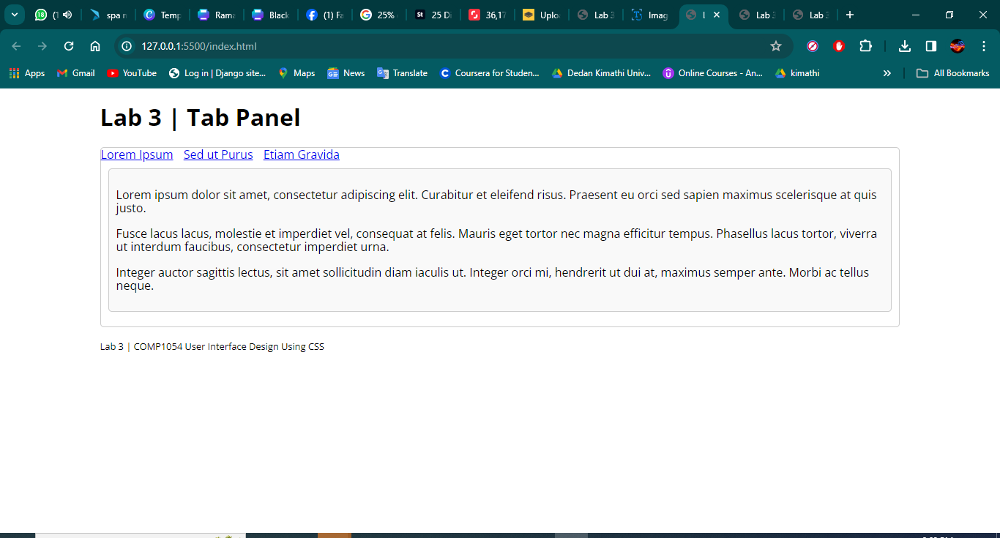
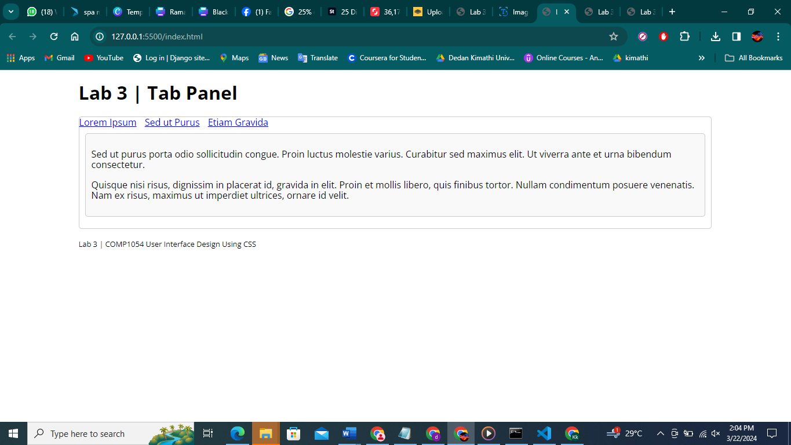
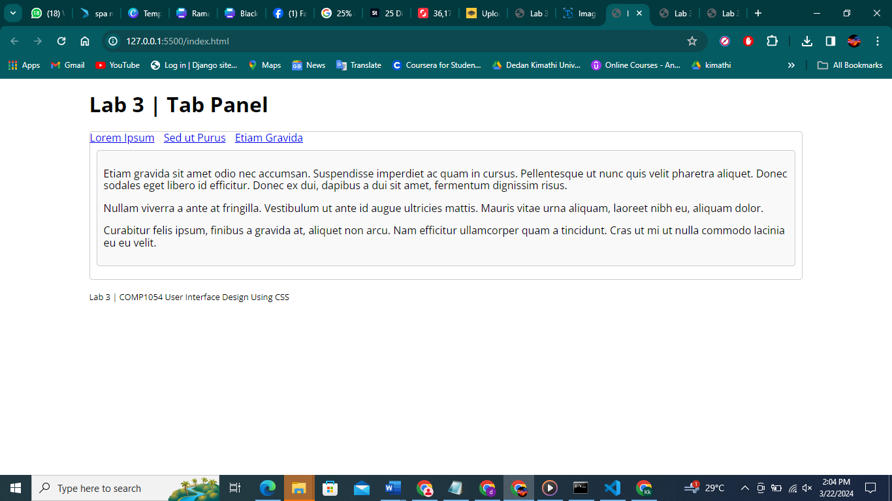

# Lab 3: Tab Panel

This is a simple tab panel implementation for Lab 3 of COMP1054 User Interface Design Using CSS.

## Description

This lab project demonstrates how to create a tabbed interface using HTML, CSS, and JavaScript. It consists of three tabs, each containing some dummy content. The tabs allow users to switch between different sections of content without leaving the page.

## Getting Started

To get a local copy up and running follow these simple steps.

### Prerequisites

- Web browser (Google Chrome, Mozilla Firefox, etc.)

### images

